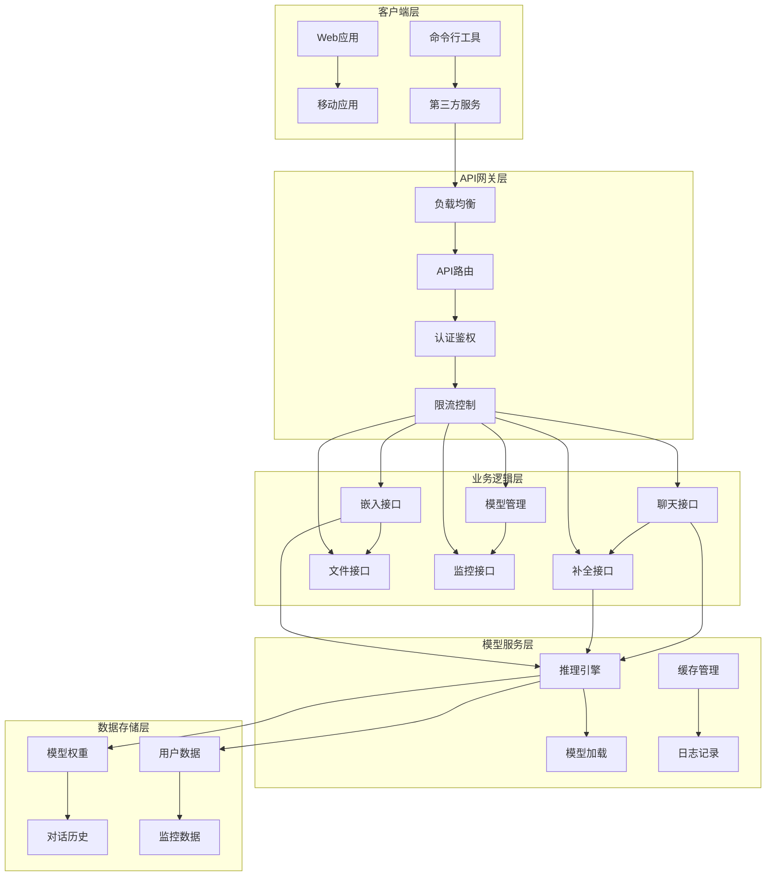

# MiniMind API接口文档

## API概览

MiniMind提供完整的API接口，支持OpenAI API兼容协议和自定义REST API，方便集成到各种应用中。

### API架构图



## 基础配置

### 启动API服务

#### 命令行启动
```bash
# 基本启动
python scripts/serve_openai_api.py \
    --model_path ./MiniMind2 \
    --host 0.0.0.0 \
    --port 8000 \
    --api_key your_secret_key

# 高级配置
python scripts/serve_openai_api.py \
    --model_path ./MiniMind2 \
    --host 0.0.0.0 \
    --port 8000 \
    --api_key your_secret_key \
    --max_tokens 2048 \
    --temperature 0.7 \
    --top_p 0.9 \
    --workers 4 \
    --log_level info
```

#### Docker启动
```bash
# 使用Docker
docker run -d \
    --name minimind-api \
    -p 8000:8000 \
    -v ./models:/app/models \
    minimind:latest \
    python scripts/serve_openai_api.py \
    --model_path /app/models/MiniMind2 \
    --host 0.0.0.0 \
    --port 8000
```

### 服务配置参数

| 参数 | 类型 | 默认值 | 说明 |
|------|------|--------|------|
| `--model_path` | string | required | 模型权重路径 |
| `--host` | string | 0.0.0.0 | 服务监听地址 |
| `--port` | int | 8000 | 服务监听端口 |
| `--api_key` | string | None | API密钥（可选） |
| `--max_tokens` | int | 2048 | 最大生成token数 |
| `--temperature` | float | 0.7 | 采样温度 |
| `--top_p` | float | 0.9 | 核采样参数 |
| `--workers` | int | 4 | 工作进程数 |
| `--log_level` | string | info | 日志级别 |

## OpenAI API兼容接口

### 1. 聊天接口（Chat Completions）

#### 接口说明
- **端点**：`POST /v1/chat/completions`
- **功能**：生成对话响应
- **兼容性**：完全兼容OpenAI Chat API

#### 请求示例
```bash
curl -X POST "http://localhost:8000/v1/chat/completions" \
  -H "Content-Type: application/json" \
  -H "Authorization: Bearer your_api_key" \
  -d '{
    "model": "minimind",
    "messages": [
      {"role": "system", "content": "你是一个有用的助手。"},
      {"role": "user", "content": "介绍一下MiniMind项目"}
    ],
    "max_tokens": 1024,
    "temperature": 0.7,
    "top_p": 0.9,
    "stream": false
  }'
```

#### 请求参数

| 参数 | 类型 | 必需 | 说明 |
|------|------|------|------|
| `model` | string | 是 | 模型名称，固定为"minimind" |
| `messages` | array | 是 | 消息列表 |
| `max_tokens` | integer | 否 | 最大生成token数 |
| `temperature` | number | 否 | 采样温度（0-2） |
| `top_p` | number | 否 | 核采样参数（0-1） |
| `stream` | boolean | 否 | 是否流式输出 |
| `stop` | array | 否 | 停止词列表 |
| `presence_penalty` | number | 否 | 存在惩罚（-2到2） |
| `frequency_penalty` | number | 否 | 频率惩罚（-2到2） |

#### 响应示例
```json
{
  "id": "chatcmpl-1234567890abcdef",
  "object": "chat.completion",
  "created": 1677652288,
  "model": "minimind",
  "choices": [
    {
      "index": 0,
      "message": {
        "role": "assistant",
        "content": "MiniMind是一个轻量级语言模型训练项目..."
      },
      "finish_reason": "stop"
    }
  ],
  "usage": {
    "prompt_tokens": 15,
    "completion_tokens": 120,
    "total_tokens": 135
  }
}
```

#### 流式响应
```bash
# 流式请求
curl -X POST "http://localhost:8000/v1/chat/completions" \
  -H "Content-Type: application/json" \
  -H "Authorization: Bearer your_api_key" \
  -d '{
    "model": "minimind",
    "messages": [{"role": "user", "content": "你好"}],
    "stream": true
  }'

# 流式响应（逐块返回）
data: {"id":"chatcmpl-123","object":"chat.completion.chunk","created":1677652288,"model":"minimind","choices":[{"index":0,"delta":{"role":"assistant","content":"你"},"finish_reason":null}]}
data: {"id":"chatcmpl-123","object":"chat.completion.chunk","created":1677652288,"model":"minimind","choices":[{"index":0,"delta":{"content":"好"},"finish_reason":null}]}
data: [DONE]
```

### 2. 补全接口（Completions）

#### 接口说明
- **端点**：`POST /v1/completions`
- **功能**：文本补全
- **兼容性**：兼容OpenAI Completions API

#### 请求示例
```bash
curl -X POST "http://localhost:8000/v1/completions" \
  -H "Content-Type: application/json" \
  -H "Authorization: Bearer your_api_key" \
  -d '{
    "model": "minimind",
    "prompt": "今天天气很好，",
    "max_tokens": 50,
    "temperature": 0.7
  }'
```

#### 响应示例
```json
{
  "id": "cmpl-1234567890abcdef",
  "object": "text_completion",
  "created": 1677652288,
  "model": "minimind",
  "choices": [
    {
      "text": "适合出去散步。公园里的花开得很漂亮，小鸟在树上唱歌。",
      "index": 0,
      "logprobs": null,
      "finish_reason": "length"
    }
  ],
  "usage": {
    "prompt_tokens": 5,
    "completion_tokens": 20,
    "total_tokens": 25
  }
}
```

### 3. 嵌入接口（Embeddings）

#### 接口说明
- **端点**：`POST /v1/embeddings`
- **功能**：文本向量化
- **兼容性**：兼容OpenAI Embeddings API

#### 请求示例
```bash
curl -X POST "http://localhost:8000/v1/embeddings" \
  -H "Content-Type: application/json" \
  -H "Authorization: Bearer your_api_key" \
  -d '{
    "model": "minimind",
    "input": ["今天天气很好", "MiniMind是一个轻量级模型"]
  }'
```

#### 响应示例
```json
{
  "object": "list",
  "data": [
    {
      "object": "embedding",
      "embedding": [0.1, 0.2, 0.3, ...],
      "index": 0
    },
    {
      "object": "embedding",
      "embedding": [0.4, 0.5, 0.6, ...],
      "index": 1
    }
  ],
  "model": "minimind",
  "usage": {
    "prompt_tokens": 20,
    "total_tokens": 20
  }
}
```

## 自定义REST API接口

### 1. 模型信息接口

#### 获取模型列表
- **端点**：`GET /api/v1/models`
- **功能**：获取可用模型列表

```bash
curl -X GET "http://localhost:8000/api/v1/models" \
  -H "Authorization: Bearer your_api_key"
```

**响应示例**
```json
{
  "models": [
    {
      "id": "minimind",
      "name": "MiniMind",
      "description": "轻量级语言模型",
      "version": "2.0",
      "context_length": 32768,
      "parameters": "25.8M",
      "supported_features": ["chat", "completion", "embedding"]
    }
  ]
}
```

#### 获取模型详情
- **端点**：`GET /api/v1/models/{model_id}`
- **功能**：获取指定模型详情

```bash
curl -X GET "http://localhost:8000/api/v1/models/minimind" \
  -H "Authorization: Bearer your_api_key"
```

### 2. 健康检查接口

#### 服务状态检查
- **端点**：`GET /health`
- **功能**：检查服务健康状态

```bash
curl -X GET "http://localhost:8000/health"
```

**响应示例**
```json
{
  "status": "healthy",
  "timestamp": "2024-01-01T12:00:00Z",
  "version": "2.0.0",
  "model_loaded": true,
  "gpu_available": true,
  "gpu_memory_usage": "45%"
}
```

#### 详细状态检查
- **端点**：`GET /health/detailed`
- **功能**：获取详细服务状态

```bash
curl -X GET "http://localhost:8000/health/detailed"
```

### 3. 批量处理接口

#### 批量聊天
- **端点**：`POST /api/v1/batch/chat`
- **功能**：批量处理对话请求

```bash
curl -X POST "http://localhost:8000/api/v1/batch/chat" \
  -H "Content-Type: application/json" \
  -H "Authorization: Bearer your_api_key" \
  -d '{
    "requests": [
      {
        "messages": [{"role": "user", "content": "问题1"}],
        "max_tokens": 100
      },
      {
        "messages": [{"role": "user", "content": "问题2"}],
        "max_tokens": 150
      }
    ],
    "parallel": 2
  }'
```

#### 批量嵌入
- **端点**：`POST /api/v1/batch/embeddings`
- **功能**：批量生成文本嵌入

```bash
curl -X POST "http://localhost:8000/api/v1/batch/embeddings" \
  -H "Content-Type: application/json" \
  -H "Authorization: Bearer your_api_key" \
  -d '{
    "texts": ["文本1", "文本2", "文本3"],
    "batch_size": 32
  }'
```

## 认证与安全

### API密钥认证

#### 配置API密钥
```python
# 服务启动时配置
python scripts/serve_openai_api.py --api_key "your_secret_key"

# 环境变量配置
export MINIMIND_API_KEY="your_secret_key"
python scripts/serve_openai_api.py
```

#### 请求头认证
```bash
# 使用Bearer Token认证
curl -H "Authorization: Bearer your_secret_key" \
  http://localhost:8000/v1/chat/completions
```

### 访问控制

#### IP白名单
```python
# 配置IP白名单
ALLOWED_IPS = ["192.168.1.0/24", "10.0.0.1"]

@app.middleware("http")
async def check_ip(request: Request, call_next):
    client_ip = request.client.host
    if client_ip not in ALLOWED_IPS:
        return JSONResponse(
            status_code=403,
            content={"error": "IP address not allowed"}
        )
    return await call_next(request)
```

#### 速率限制
```python
from slowapi import Limiter
from slowapi.util import get_remote_address

limiter = Limiter(key_func=get_remote_address)

# 限制每分钟100次请求
@app.post("/v1/chat/completions")
@limiter.limit("100/minute")
async def chat_completion(request: Request):
    # 处理请求
    pass
```

## 错误处理

### 错误码说明

| 错误码 | 说明 | 解决方案 |
|--------|------|----------|
| 400 | 请求参数错误 | 检查请求参数格式 |
| 401 | 认证失败 | 检查API密钥 |
| 403 | 权限不足 | 检查IP白名单和权限 |
| 404 | 资源不存在 | 检查模型路径和接口路径 |
| 429 | 请求频率过高 | 降低请求频率 |
| 500 | 服务器内部错误 | 检查服务日志 |
| 503 | 服务不可用 | 检查模型加载状态 |

### 错误响应格式
```json
{
  "error": {
    "code": 400,
    "message": "Invalid request parameters",
    "type": "invalid_request_error",
    "param": "messages",
    "details": "messages field is required"
  }
}
```

## 客户端SDK

### Python客户端

#### 安装客户端
```bash
pip install minimind-client
```

#### 使用示例
```python
from minimind_client import MiniMindClient

# 初始化客户端
client = MiniMindClient(
    base_url="http://localhost:8000",
    api_key="your_secret_key"
)

# 聊天接口
response = client.chat.completions.create(
    model="minimind",
    messages=[{"role": "user", "content": "你好"}],
    max_tokens=100
)

print(response.choices[0].message.content)

# 嵌入接口
embeddings = client.embeddings.create(
    model="minimind",
    input=["文本1", "文本2"]
)

print(embeddings.data[0].embedding)
```

### JavaScript客户端

#### 安装客户端
```bash
npm install minimind-client
```

#### 使用示例
```javascript
import { MiniMindClient } from 'minimind-client';

const client = new MiniMindClient({
    baseUrl: 'http://localhost:8000',
    apiKey: 'your_secret_key'
});

// 聊天接口
const response = await client.chat.completions.create({
    model: 'minimind',
    messages: [{ role: 'user', content: 'Hello' }],
    max_tokens: 100
});

console.log(response.choices[0].message.content);

// 嵌入接口
const embeddings = await client.embeddings.create({
    model: 'minimind',
    input: ['Text 1', 'Text 2']
});

console.log(embeddings.data[0].embedding);
```

## 性能优化

### 缓存策略

#### 响应缓存
```python
from fastapi_cache import FastAPICache
from fastapi_cache.backends.redis import RedisBackend

# 配置Redis缓存
redis = RedisBackend("redis://localhost:6379")
FastAPICache.init(redis, prefix="minimind-cache")

@app.post("/v1/chat/completions")
@cache(expire=300)  # 缓存5分钟
async def chat_completion(request: ChatRequest):
    # 处理请求
    pass
```

#### 模型缓存
```python
# 预加载模型到GPU缓存
model = load_model("./MiniMind2")
model.eval()

# 启用KV缓存
model.config.use_cache = True
```

### 并发处理

#### 异步处理
```python
import asyncio
from concurrent.futures import ThreadPoolExecutor

executor = ThreadPoolExecutor(max_workers=4)

@app.post("/v1/chat/completions")
async def chat_completion(request: ChatRequest):
    # 异步处理推理请求
    loop = asyncio.get_event_loop()
    response = await loop.run_in_executor(
        executor, 
        generate_response, 
        request.messages, 
        request.max_tokens
    )
    return response
```

## 监控与日志

### 请求日志
```python
import logging

# 配置日志
logging.basicConfig(
    level=logging.INFO,
    format='%(asctime)s - %(name)s - %(levelname)s - %(message)s'
)

logger = logging.getLogger("minimind-api")

@app.middleware("http")
async def log_requests(request: Request, call_next):
    start_time = time.time()
    response = await call_next(request)
    
    # 记录请求日志
    logger.info(f"{request.method} {request.url.path} - {response.status_code} - {time.time()-start_time:.3f}s")
    
    return response
```

### 性能监控
```python
from prometheus_client import Counter, Histogram, generate_latest

# 定义指标
requests_total = Counter('minimind_requests_total', 'Total requests')
request_duration = Histogram('minimind_request_duration_seconds', 'Request duration')

@app.get("/metrics")
async def metrics():
    return Response(generate_latest(), media_type="text/plain")
```

## 总结

MiniMind API提供了完整的接口服务：

1. **OpenAI兼容**：完全兼容Chat、Completions、Embeddings接口
2. **自定义接口**：模型管理、健康检查、批量处理等
3. **安全认证**：API密钥、IP白名单、速率限制
4. **性能优化**：缓存策略、并发处理、监控日志
5. **多语言SDK**：Python、JavaScript客户端支持

通过这些接口，可以轻松将MiniMind集成到各种应用中，从个人项目到企业级应用都能提供稳定可靠的服务。