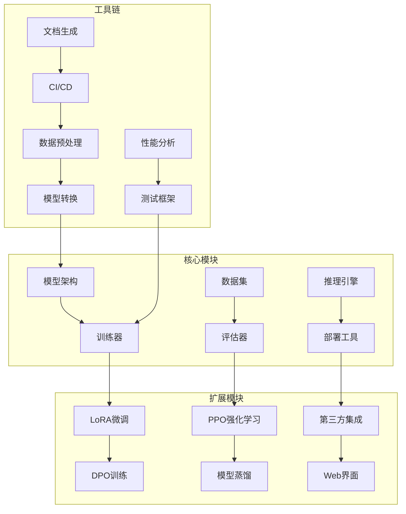

# MiniMind 开发者指南

## 项目开发概览

MiniMind是一个开源的语言模型训练框架，欢迎开发者参与贡献。本指南详细说明项目架构、开发流程和贡献规范。

### 开发架构图



## 开发环境搭建

### 1. 环境要求

#### 系统要求
- **操作系统**：Linux (Ubuntu 20.04+), macOS 12+, Windows 10+
- **Python**：3.8, 3.9, 3.10, 3.11
- **CUDA**：11.7+ (GPU训练需要)
- **PyTorch**：2.0.0+

#### 开发工具推荐
```bash
# 代码编辑器
code .  # VS Code
# 或
vim     # Vim

# 版本控制
git --version

# Python环境管理
conda create -n minimind python=3.10
conda activate minimind

# 包管理
pip install -U pip setuptools wheel
```

### 2. 项目克隆与配置

#### 克隆项目
```bash
# 克隆主仓库
git clone https://github.com/jingyaogong/minimind.git
cd minimind

# 或克隆fork的仓库
git clone https://github.com/YOUR_USERNAME/minimind.git
cd minimind
git remote add upstream https://github.com/jingyaogong/minimind.git
```

#### 安装开发依赖
```bash
# 安装基础依赖
pip install -r requirements.txt

# 安装开发依赖
pip install -r requirements-dev.txt

# 安装预提交钩子
pre-commit install
```

#### 开发环境验证
```bash
# 运行测试
python -m pytest tests/ -v

# 代码质量检查
flake8 . --count --select=E9,F63,F7,F82 --show-source --statistics

# 类型检查
mypy model/ trainer/ dataset/
```

## 项目架构详解

### 1. 目录结构

```
minimind/
├── model/                 # 模型架构
│   ├── model_minimind.py  # 核心模型实现
│   ├── config.py          # 模型配置
│   └── attention.py      # 注意力机制
├── trainer/              # 训练器
│   ├── train_pretrain.py # 预训练
│   ├── train_sft.py      # SFT微调
│   ├── train_dpo.py      # DPO训练
│   └── train_ppo.py      # PPO训练
├── dataset/              # 数据集处理
│   ├── lm_dataset.py     # 语言模型数据集
│   ├── sft_dataset.py    # SFT数据集
│   └── rlhf_dataset.py    # RLHF数据集
├── scripts/              # 脚本工具
│   ├── serve_openai_api.py # API服务
│   ├── web_demo.py       # Web演示
│   └── convert_model.py  # 模型转换
├── tests/                # 测试代码
│   ├── test_model.py     # 模型测试
│   ├── test_trainer.py   # 训练器测试
│   └── test_dataset.py   # 数据集测试
├── docs/                 # 文档
│   ├── api/              # API文档
│   ├── tutorials/        # 教程
│   └── design/           # 设计文档
└── examples/             # 示例代码
    ├── basic_training.py # 基础训练示例
    ├── fine_tuning.py    # 微调示例
    └── deployment.py     # 部署示例
```

### 2. 核心模块设计

#### 模型架构 (model/)

**模型配置类** (`model/config.py`)
```python
@dataclass
class MiniMindConfig:
    """MiniMind模型配置类"""
    vocab_size: int = 6400
    hidden_size: int = 512
    num_hidden_layers: int = 8
    num_attention_heads: int = 8
    max_position_embeddings: int = 32768
    
    # 注意力机制配置
    use_flash_attention: bool = True
    rope_theta: float = 10000.0
    
    # 激活函数配置
    hidden_act: str = "swiglu"
    
    def __post_init__(self):
        """配置验证"""
        assert self.hidden_size % self.num_attention_heads == 0
        assert self.vocab_size > 0
```

**核心模型类** (`model/model_minimind.py`)
```python
class MiniMindForCausalLM(nn.Module):
    """MiniMind因果语言模型"""
    
    def __init__(self, config: MiniMindConfig):
        super().__init__()
        self.config = config
        
        # 嵌入层
        self.embed_tokens = nn.Embedding(config.vocab_size, config.hidden_size)
        
        # Transformer层
        self.layers = nn.ModuleList([
            TransformerLayer(config) for _ in range(config.num_hidden_layers)
        ])
        
        # 输出层
        self.lm_head = nn.Linear(config.hidden_size, config.vocab_size, bias=False)
        
    def forward(self, input_ids, attention_mask=None, labels=None):
        """前向传播"""
        # 嵌入层
        hidden_states = self.embed_tokens(input_ids)
        
        # Transformer层
        for layer in self.layers:
            hidden_states = layer(hidden_states, attention_mask)
        
        # 输出层
        logits = self.lm_head(hidden_states)
        
        # 计算损失
        loss = None
        if labels is not None:
            loss = self.compute_loss(logits, labels)
        
        return CausalLMOutput(loss=loss, logits=logits)
```

#### 训练器设计 (trainer/)

**基础训练器类**
```python
class BaseTrainer:
    """训练器基类"""
    
    def __init__(self, model, train_dataset, eval_dataset=None, **kwargs):
        self.model = model
        self.train_dataset = train_dataset
        self.eval_dataset = eval_dataset
        
        # 训练配置
        self.epochs = kwargs.get('epochs', 1)
        self.batch_size = kwargs.get('batch_size', 32)
        self.learning_rate = kwargs.get('learning_rate', 5e-4)
        
        # 优化器
        self.optimizer = AdamW(model.parameters(), lr=self.learning_rate)
        
    def train_epoch(self, dataloader):
        """训练一个epoch"""
        self.model.train()
        total_loss = 0
        
        for batch in dataloader:
            # 前向传播
            outputs = self.model(**batch)
            loss = outputs.loss
            
            # 反向传播
            self.optimizer.zero_grad()
            loss.backward()
            self.optimizer.step()
            
            total_loss += loss.item()
        
        return total_loss / len(dataloader)
    
    def evaluate(self, dataloader):
        """模型评估"""
        self.model.eval()
        total_loss = 0
        
        with torch.no_grad():
            for batch in dataloader:
                outputs = self.model(**batch)
                total_loss += outputs.loss.item()
        
        return total_loss / len(dataloader)
```

### 3. 数据流设计

#### 数据处理流程
```python
# dataset/lm_dataset.py
class LMDataset(Dataset):
    """语言模型数据集"""
    
    def __init__(self, data_path, tokenizer, max_length=512):
        self.data = self.load_data(data_path)
        self.tokenizer = tokenizer
        self.max_length = max_length
    
    def load_data(self, data_path):
        """加载数据"""
        with open(data_path, 'r', encoding='utf-8') as f:
            return [json.loads(line) for line in f]
    
    def __len__(self):
        return len(self.data)
    
    def __getitem__(self, idx):
        item = self.data[idx]
        text = item['text']
        
        # Tokenize
        tokens = self.tokenizer.encode(text)
        
        # 截断或填充
        if len(tokens) > self.max_length:
            tokens = tokens[:self.max_length]
        else:
            tokens = tokens + [self.tokenizer.pad_token_id] * (self.max_length - len(tokens))
        
        return {
            'input_ids': torch.tensor(tokens),
            'attention_mask': torch.tensor([1] * len(tokens) + [0] * (self.max_length - len(tokens)))
        }
```

## 开发工作流

### 1. 功能开发流程

#### 创建功能分支
```bash
# 同步主分支
git checkout main
git pull upstream main

# 创建功能分支
git checkout -b feature/your-feature-name

# 或修复分支
git checkout -b fix/issue-number
```

#### 开发与测试
```bash
# 运行相关测试
python -m pytest tests/test_your_feature.py -v

# 代码质量检查
flake8 your_new_file.py

# 类型检查
mypy your_new_file.py

# 提交代码
git add .
git commit -m "feat: add new feature description"
```

#### 提交Pull Request
```bash
# 推送到你的fork
git push origin feature/your-feature-name

# 在GitHub创建PR
# 填写PR模板，描述变更内容
```

### 2. 代码规范

#### 代码风格
- **缩进**：4个空格
- **行长度**：最大120字符
- **导入顺序**：标准库 → 第三方库 → 本地模块
- **命名规范**：snake_case（变量/函数），PascalCase（类）

#### 文档规范
```python
def train_model(model, dataset, epochs=10):
    """
    训练模型
    
    Args:
        model: 要训练的模型
        dataset: 训练数据集
        epochs: 训练轮数，默认为10
    
    Returns:
        dict: 训练结果，包含损失和指标
    
    Example:
        >>> result = train_model(model, dataset, epochs=5)
        >>> print(result['final_loss'])
    """
    # 实现代码
    pass
```

#### 提交信息规范
```bash
# 格式: type(scope): description

git commit -m "feat(model): add new attention mechanism"
git commit -m "fix(trainer): fix gradient accumulation bug"
git commit -m "docs: update API documentation"
git commit -m "test: add model inference tests"
```

**提交类型说明**：
- `feat`: 新功能
- `fix`: 修复bug
- `docs`: 文档更新
- `style`: 代码格式调整
- `refactor`: 代码重构
- `test`: 测试相关
- `chore`: 构建工具或依赖更新

### 3. 测试策略

#### 单元测试
```python
# tests/test_model.py
import pytest
import torch
from model.model_minimind import MiniMindForCausalLM
from model.config import MiniMindConfig

class TestMiniMindModel:
    """MiniMind模型测试类"""
    
    def test_model_initialization(self):
        """测试模型初始化"""
        config = MiniMindConfig(
            vocab_size=1000,
            hidden_size=128,
            num_hidden_layers=2
        )
        model = MiniMindForCausalLM(config)
        
        assert model is not None
        assert model.config.vocab_size == 1000
    
    def test_model_forward(self):
        """测试模型前向传播"""
        config = MiniMindConfig(vocab_size=1000, hidden_size=128)
        model = MiniMindForCausalLM(config)
        
        # 创建测试输入
        input_ids = torch.randint(0, 1000, (2, 10))
        
        # 前向传播
        outputs = model(input_ids)
        
        assert outputs.logits.shape == (2, 10, 1000)
```

#### 集成测试
```python
# tests/test_training.py
class TestTrainingPipeline:
    """训练流程集成测试"""
    
    def test_pretraining_pipeline(self):
        """测试预训练流程"""
        # 创建模拟数据
        dataset = MockDataset()
        model = create_test_model()
        
        # 训练一个epoch
        trainer = PretrainTrainer(model, dataset, epochs=1)
        loss = trainer.train()
        
        assert loss < initial_loss  # 损失应该下降
        assert model.training is False  # 训练后应为eval模式
```

#### 性能测试
```python
# tests/test_performance.py
class TestModelPerformance:
    """模型性能测试"""
    
    def test_inference_speed(self):
        """测试推理速度"""
        model = load_trained_model()
        
        # 预热
        for _ in range(10):
            model.generate("test")
        
        # 正式测试
        start_time = time.time()
        for _ in range(100):
            model.generate("test input")
        end_time = time.time()
        
        avg_time = (end_time - start_time) / 100
        assert avg_time < 0.1  # 平均响应时间应小于100ms
```

## 扩展开发指南

### 1. 添加新模型架构

#### 创建新配置
```python
# model/new_model_config.py
@dataclass
class NewModelConfig(MiniMindConfig):
    """新模型配置"""
    
    # 新增参数
    new_parameter: int = 64
    activation_function: str = "gelu"
    
    def validate(self):
        """参数验证"""
        super().validate()
        assert self.new_parameter > 0
```

#### 实现新模型
```python
# model/new_model.py
class NewModelForCausalLM(MiniMindForCausalLM):
    """新模型实现"""
    
    def __init__(self, config: NewModelConfig):
        super().__init__(config)
        
        # 新增层
        self.new_layer = NewLayer(config.new_parameter)
        
    def forward(self, input_ids, **kwargs):
        """重写前向传播"""
        # 调用父类方法
        outputs = super().forward(input_ids, **kwargs)
        
        # 新增处理
        new_outputs = self.new_layer(outputs.logits)
        
        return CausalLMOutput(
            loss=outputs.loss,
            logits=new_outputs
        )
```

### 2. 添加新训练算法

#### 实现新训练器
```python
# trainer/new_trainer.py
class NewTrainer(BaseTrainer):
    """新训练算法"""
    
    def __init__(self, model, dataset, **kwargs):
        super().__init__(model, dataset, **kwargs)
        
        # 新增训练参数
        self.new_parameter = kwargs.get('new_parameter', 0.1)
        
    def train_epoch(self, dataloader):
        """重写训练逻辑"""
        self.model.train()
        total_loss = 0
        
        for batch in dataloader:
            # 新增训练逻辑
            outputs = self.custom_forward(batch)
            loss = self.custom_loss(outputs)
            
            # 优化步骤
            self.optimizer.zero_grad()
            loss.backward()
            self.optimizer.step()
            
            total_loss += loss.item()
        
        return total_loss / len(dataloader)
    
    def custom_forward(self, batch):
        """自定义前向传播"""
        # 实现新逻辑
        pass
```

### 3. 添加新数据集格式

#### 实现新数据集类
```python
# dataset/new_dataset.py
class NewDataset(Dataset):
    """新数据集格式支持"""
    
    def __init__(self, data_path, tokenizer, **kwargs):
        self.data = self.load_new_format(data_path)
        self.tokenizer = tokenizer
        
    def load_new_format(self, data_path):
        """加载新格式数据"""
        # 实现新格式解析
        data = []
        with open(data_path, 'r') as f:
            for line in f:
                # 解析新格式
                item = self.parse_line(line)
                data.append(item)
        return data
    
    def parse_line(self, line):
        """解析单行数据"""
        # 实现解析逻辑
        pass
```

## 调试与问题排查

### 1. 常见问题

#### 内存溢出
```python
# 检查GPU内存使用
torch.cuda.empty_cache()
print(f"GPU内存使用: {torch.cuda.memory_allocated() / 1024**3:.2f}GB")

# 减小batch_size或序列长度
trainer = Trainer(batch_size=8, max_seq_len=256)
```

#### 训练不稳定
```python
# 检查梯度
for name, param in model.named_parameters():
    if param.grad is not None:
        grad_norm = param.grad.norm()
        if grad_norm > 1000:
            print(f"梯度爆炸: {name}, norm: {grad_norm}")

# 启用梯度裁剪
torch.nn.utils.clip_grad_norm_(model.parameters(), max_norm=1.0)
```

#### 模型不收敛
```python
# 检查学习率
print(f"当前学习率: {optimizer.param_groups[0]['lr']}")

# 启用学习率调度器
scheduler = torch.optim.lr_scheduler.CosineAnnealingLR(optimizer, T_max=100)
```

### 2. 调试工具

#### 日志调试
```python
import logging

# 配置详细日志
logging.basicConfig(level=logging.DEBUG)
logger = logging.getLogger(__name__)

# 在关键位置添加日志
logger.debug(f"模型输入形状: {input_ids.shape}")
logger.info(f"训练损失: {loss.item():.4f}")
```

#### 性能分析
```python
import torch.autograd.profiler as profiler

# 性能分析
with profiler.profile(record_shapes=True) as prof:
    model(input_ids)

print(prof.key_averages().table(sort_by="cpu_time_total", row_limit=10))
```

## 贡献指南

### 1. 贡献流程

1. **Fork仓库**：在GitHub上fork项目
2. **创建分支**：基于main分支创建功能分支
3. **开发测试**：实现功能并添加测试
4. **代码审查**：提交PR等待审查
5. **合并发布**：通过审查后合并到main分支

### 2. 贡献类型

- **Bug修复**：修复已知问题
- **功能增强**：添加新功能
- **性能优化**：提升训练/推理性能
- **文档改进**：完善文档和示例
- **测试覆盖**：增加测试用例

### 3. 社区规范

- **友好交流**：保持友好和尊重的讨论氛围
- **问题报告**：提供详细的问题描述和复现步骤
- **代码质量**：确保代码符合项目规范
- **持续学习**：积极参与社区讨论和学习

## 总结

MiniMind开发者指南提供了完整的项目开发指导：

1. **环境搭建**：详细的开发环境配置
2. **架构理解**：核心模块设计和数据流
3. **开发流程**：规范的代码开发和测试流程
4. **扩展开发**：如何添加新功能和算法
5. **调试排查**：常见问题解决方法
6. **贡献指南**：参与项目贡献的规范

通过本指南，开发者可以快速上手MiniMind项目开发，为项目做出有价值的贡献。