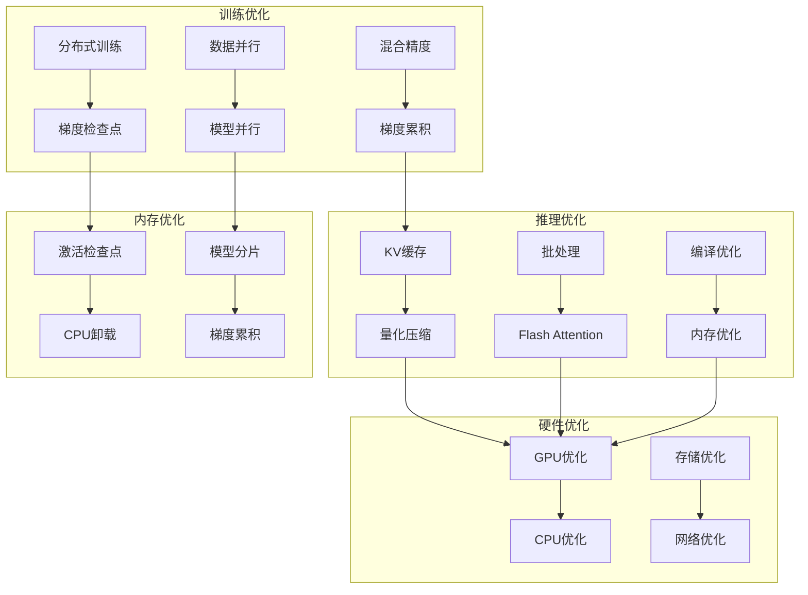

# MiniMind 性能优化指南

## 性能优化概览

MiniMind提供了全面的性能优化方案，涵盖训练速度、推理速度、内存使用和计算效率等多个维度。本指南详细说明各种优化技术和最佳实践。

### 优化架构图



## 训练性能优化

### 1. 混合精度训练

#### FP16混合精度
```python
from torch.cuda.amp import autocast, GradScaler

# 初始化梯度缩放器
scaler = GradScaler()

def train_step(model, batch, optimizer):
    """混合精度训练步骤"""
    optimizer.zero_grad()
    
    # 自动混合精度
    with autocast():
        outputs = model(**batch)
        loss = outputs.loss
    
    # 缩放损失并反向传播
    scaler.scale(loss).backward()
    
    # 缩放梯度并更新参数
    scaler.step(optimizer)
    scaler.update()
    
    return loss.item()
```

#### BF16混合精度
```python
# 启用BF16（A100/H100推荐）
model = model.bfloat16()

# 训练配置
torch.set_float32_matmul_precision('high')  # TF32加速

# 优化器配置
optimizer = AdamW(model.parameters(), lr=1e-4)
```

#### 性能对比
| 精度类型 | 内存占用 | 训练速度 | 数值稳定性 |
|---------|---------|---------|-----------|
| FP32    | 100%    | 基准     | 最佳       |
| FP16    | 50%     | 2-3倍    | 需要缩放   |
| BF16    | 50%     | 2-3倍    | 较好       |

### 2. 梯度累积与检查点

#### 梯度累积
```python
def train_with_gradient_accumulation(model, dataloader, optimizer, accumulation_steps=4):
    """梯度累积训练"""
    model.train()
    total_loss = 0
    
    for i, batch in enumerate(dataloader):
        # 前向传播
        outputs = model(**batch)
        loss = outputs.loss / accumulation_steps  # 损失缩放
        
        # 反向传播
        loss.backward()
        
        # 累积梯度后更新
        if (i + 1) % accumulation_steps == 0:
            optimizer.step()
            optimizer.zero_grad()
        
        total_loss += loss.item() * accumulation_steps
    
    return total_loss / len(dataloader)
```

#### 梯度检查点
```python
# 启用梯度检查点（减少内存，增加计算）
model.gradient_checkpointing_enable()

# 或手动配置
from torch.utils.checkpoint import checkpoint

def custom_forward(*inputs):
    """自定义前向传播用于检查点"""
    return model(*inputs)

outputs = checkpoint(custom_forward, input_ids, attention_mask)
```

### 3. 分布式训练优化

#### 数据并行（DDP）
```bash
# 启动多GPU训练
torchrun --nproc_per_node=4 trainer/train_pretrain.py \
    --batch_size 32 \
    --gradient_accumulation_steps 2
```

#### 模型并行
```python
# 手动模型分片
class ModelParallelMiniMind(nn.Module):
    def __init__(self, config, device_ids=[0, 1]):
        super().__init__()
        
        # 将模型分片到不同GPU
        self.embedding = nn.Embedding(config.vocab_size, config.hidden_size).to(device_ids[0])
        
        # 前N层在GPU 0
        self.layers_1 = nn.ModuleList([
            TransformerLayer(config).to(device_ids[0]) 
            for _ in range(config.num_hidden_layers // 2)
        ])
        
        # 后N层在GPU 1
        self.layers_2 = nn.ModuleList([
            TransformerLayer(config).to(device_ids[1]) 
            for _ in range(config.num_hidden_layers // 2)
        ])
        
        self.lm_head = nn.Linear(config.hidden_size, config.vocab_size).to(device_ids[1])
    
    def forward(self, input_ids):
        # 跨设备数据传输
        x = self.embedding(input_ids).to(device_ids[0])
        
        for layer in self.layers_1:
            x = layer(x)
        
        x = x.to(device_ids[1])
        
        for layer in self.layers_2:
            x = layer(x)
        
        return self.lm_head(x)
```

#### 混合并行策略
```python
# 使用Deepspeed Zero优化
import deepspeed

# 配置Deepspeed
ds_config = {
    "train_batch_size": 32,
    "gradient_accumulation_steps": 2,
    "optimizer": {
        "type": "AdamW",
        "params": {
            "lr": 1e-4
        }
    },
    "zero_optimization": {
        "stage": 2,  # Zero-2优化
        "offload_optimizer": {
            "device": "cpu"
        }
    }
}

# 初始化Deepspeed
model, optimizer, _, _ = deepspeed.initialize(
    model=model,
    config=ds_config
)
```

## 推理性能优化

### 1. KV缓存优化

#### 静态KV缓存
```python
class OptimizedMiniMindForCausalLM(MiniMindForCausalLM):
    """优化推理版本"""
    
    def __init__(self, config):
        super().__init__(config)
        self.kv_cache = None
    
    def generate(self, input_ids, max_new_tokens=100, use_cache=True):
        """优化生成函数"""
        if use_cache and self.kv_cache is None:
            # 初始化KV缓存
            self.kv_cache = [None] * len(self.layers)
        
        generated = input_ids
        
        for _ in range(max_new_tokens):
            # 只处理最后一个token（增量推理）
            if use_cache and self.kv_cache[0] is not None:
                inputs = generated[:, -1:]
            else:
                inputs = generated
            
            # 前向传播（使用缓存）
            outputs = self.forward_with_cache(inputs, self.kv_cache)
            next_token = self.sample_next_token(outputs.logits[:, -1, :])
            
            generated = torch.cat([generated, next_token], dim=1)
        
        return generated
    
    def forward_with_cache(self, input_ids, kv_cache):
        """使用KV缓存的前向传播"""
        hidden_states = self.embed_tokens(input_ids)
        
        new_kv_cache = []
        for i, layer in enumerate(self.layers):
            hidden_states, new_cache = layer(
                hidden_states, 
                past_key_value=kv_cache[i]
            )
            new_kv_cache.append(new_cache)
        
        self.kv_cache = new_kv_cache
        logits = self.lm_head(hidden_states)
        
        return CausalLMOutput(logits=logits)
```

#### 动态序列长度
```python
def dynamic_batching(requests, max_batch_size=32):
    """动态批处理"""
    # 按序列长度排序
    sorted_requests = sorted(requests, key=lambda x: len(x['input_ids']))
    
    batches = []
    current_batch = []
    
    for request in sorted_requests:
        current_batch.append(request)
        
        # 达到批大小或序列长度差异过大时创建新批次
        if (len(current_batch) >= max_batch_size or 
            (current_batch and len(request['input_ids']) > len(current_batch[0]['input_ids']) * 2)):
            batches.append(current_batch)
            current_batch = []
    
    if current_batch:
        batches.append(current_batch)
    
    return batches
```

### 2. 模型量化

#### 动态量化
```python
# 动态量化（推理时）
model = torch.quantization.quantize_dynamic(
    model, 
    {nn.Linear},  # 量化线性层
    dtype=torch.qint8
)

# 保存量化模型
torch.save(model.state_dict(), 'quantized_model.pth')
```

#### 静态量化
```python
# 静态量化（需要校准数据）
model.qconfig = torch.quantization.get_default_qconfig('fbgemm')

# 准备量化
model_prepared = torch.quantization.prepare(model, inplace=False)

# 校准（使用校准数据）
with torch.no_grad():
    for calibration_data in calibration_dataloader:
        model_prepared(calibration_data)

# 转换量化模型
model_quantized = torch.quantization.convert(model_prepared)
```

#### 量化感知训练
```python
# 量化感知训练（QAT）
model.qconfig = torch.quantization.get_default_qat_qconfig('fbgemm')
model_prepared = torch.quantization.prepare_qat(model, inplace=False)

# 正常训练（但使用量化感知）
train_model(model_prepared, train_dataloader)

# 转换量化模型
model_quantized = torch.quantization.convert(model_prepared)
```

### 3. 编译优化

#### TorchScript编译
```python
# 转换为TorchScript
model.eval()
scripted_model = torch.jit.script(model)

# 保存优化模型
torch.jit.save(scripted_model, 'optimized_model.pt')

# 加载优化模型
optimized_model = torch.jit.load('optimized_model.pt')
```

#### TorchInductor编译（PyTorch 2.0+）
```python
# 使用TorchInductor编译优化
model = torch.compile(model, backend="inductor")

# 高级编译选项
model = torch.compile(
    model, 
    backend="inductor",
    mode="max-autotune",  # 最大优化
    options={
        "triton.cudagraphs": True,  # CUDA图优化
        "shape_padding": True       # 形状填充优化
    }
)
```

## 内存优化策略

### 1. 激活检查点

#### 选择性检查点
```python
from torch.utils.checkpoint import checkpoint

class MemoryOptimizedTransformerLayer(nn.Module):
    """内存优化的Transformer层"""
    
    def __init__(self, config, use_checkpoint=True):
        super().__init__()
        self.use_checkpoint = use_checkpoint
        self.attention = Attention(config)
        self.mlp = MLP(config)
    
    def forward(self, hidden_states):
        if self.use_checkpoint and self.training:
            # 使用检查点节省内存
            hidden_states = checkpoint(self.attention, hidden_states)
            hidden_states = checkpoint(self.mlp, hidden_states)
        else:
            # 正常前向传播
            hidden_states = self.attention(hidden_states)
            hidden_states = self.mlp(hidden_states)
        
        return hidden_states
```

#### 分层检查点
```python
def forward_with_selective_checkpointing(model, input_ids, checkpoint_interval=4):
    """分层激活检查点"""
    hidden_states = model.embed_tokens(input_ids)
    
    for i, layer in enumerate(model.layers):
        # 每隔几层使用检查点
        if i % checkpoint_interval == 0 and model.training:
            hidden_states = checkpoint(layer, hidden_states)
        else:
            hidden_states = layer(hidden_states)
    
    return model.lm_head(hidden_states)
```

### 2. CPU卸载与模型分片

#### CPU卸载
```python
# 将部分层卸载到CPU
class CPUOffloadModel(nn.Module):
    def __init__(self, config):
        super().__init__()
        
        # GPU层
        self.gpu_layers = nn.ModuleList([
            TransformerLayer(config).cuda() 
            for _ in range(config.num_hidden_layers // 2)
        ])
        
        # CPU层
        self.cpu_layers = nn.ModuleList([
            TransformerLayer(config).cpu()
            for _ in range(config.num_hidden_layers // 2)
        ])
    
    def forward(self, input_ids):
        x = input_ids.cuda()
        
        # GPU层
        for layer in self.gpu_layers:
            x = layer(x)
        
        # 传输到CPU
        x = x.cpu()
        
        # CPU层
        for layer in self.cpu_layers:
            x = layer(x)
        
        return x.cuda()  # 返回GPU
```

#### 模型分片策略
```python
def shard_model_across_gpus(model, num_shards=2):
    """模型分片到多个GPU"""
    devices = [f'cuda:{i}' for i in range(num_shards)]
    
    # 计算每片的层数
    layers_per_shard = len(model.layers) // num_shards
    
    for i, device in enumerate(devices):
        start_idx = i * layers_per_shard
        end_idx = start_idx + layers_per_shard
        
        # 将层移动到对应设备
        for layer in model.layers[start_idx:end_idx]:
            layer.to(device)
    
    return model
```

## 硬件特定优化

### 1. NVIDIA GPU优化

#### CUDA核心优化
```python
# 启用TF32（A100/H100）
torch.backends.cuda.matmul.allow_tf32 = True
torch.backends.cudnn.allow_tf32 = True

# 启用Benchmark模式（固定输入大小时）
torch.backends.cudnn.benchmark = True

# 内存优化
torch.cuda.set_per_process_memory_fraction(0.9)  # 限制GPU内存使用
```

#### Flash Attention优化
```python
# 启用Flash Attention v2
from flash_attn import flash_attn_func

class FlashAttentionLayer(nn.Module):
    """Flash Attention优化层"""
    
    def forward(self, query, key, value, attention_mask=None):
        # 使用Flash Attention
        attn_output = flash_attn_func(
            query, key, value,
            dropout_p=0.0,
            softmax_scale=None,
            causal=True
        )
        
        return attn_output
```

### 2. AMD GPU优化

#### ROCm优化
```bash
# 使用ROCm的PyTorch
pip install torch torchvision torchaudio --index-url https://download.pytorch.org/whl/rocm5.4.2

# 启用MI200优化
export PYTORCH_ROCM_ARCH="gfx90a"
```

#### HIP优化
```python
# 使用HIP后端（如可用）
import torch
if torch.cuda.is_available():
    # ROCm环境下的CUDA兼容
    device = torch.device('cuda')
else:
    device = torch.device('cpu')
```

### 3. CPU优化

#### 多线程优化
```python
import torch

# 设置线程数
torch.set_num_threads(8)
torch.set_num_interop_threads(4)

# BLAS库优化（Intel MKL/OpenBLAS）
import os
os.environ['OMP_NUM_THREADS'] = '8'
os.environ['MKL_NUM_THREADS'] = '8'
```

#### AVX指令集优化
```bash
# 编译时启用AVX指令集
export CFLAGS="-march=native -mtune=native"
export CXXFLAGS="-march=native -mtune=native"

# 安装优化版本
pip install --no-binary :all: numpy
```

## 性能监控与分析

### 1. 训练监控

#### 实时性能指标
```python
import time
from collections import deque

class PerformanceMonitor:
    """性能监控器"""
    
    def __init__(self, window_size=100):
        self.loss_history = deque(maxlen=window_size)
        self.throughput_history = deque(maxlen=window_size)
        self.start_time = time.time()
    
    def update(self, loss, batch_size):
        """更新性能指标"""
        current_time = time.time()
        elapsed = current_time - self.start_time
        
        # 计算吞吐量（tokens/秒）
        throughput = batch_size / elapsed if elapsed > 0 else 0
        
        self.loss_history.append(loss)
        self.throughput_history.append(throughput)
        
        self.start_time = current_time
    
    def get_stats(self):
        """获取统计信息"""
        avg_loss = sum(self.loss_history) / len(self.loss_history) if self.loss_history else 0
        avg_throughput = sum(self.throughput_history) / len(self.throughput_history) if self.throughput_history else 0
        
        return {
            'avg_loss': avg_loss,
            'avg_throughput': avg_throughput,
            'current_loss': self.loss_history[-1] if self.loss_history else 0
        }
```

#### GPU内存监控
```python
def monitor_gpu_memory():
    """监控GPU内存使用"""
    if torch.cuda.is_available():
        allocated = torch.cuda.memory_allocated() / 1024**3  # GB
        reserved = torch.cuda.memory_reserved() / 1024**3   # GB
        
        print(f"GPU内存 - 已分配: {allocated:.2f}GB, 保留: {reserved:.2f}GB")
        
        # 内存使用率
        total_memory = torch.cuda.get_device_properties(0).total_memory / 1024**3
        usage_percentage = (allocated / total_memory) * 100
        
        print(f"GPU内存使用率: {usage_percentage:.1f}%")
```

### 2. 性能分析工具

#### PyTorch Profiler
```python
from torch.profiler import profile, record_function, ProfilerActivity

def profile_training_step(model, batch):
    """分析训练步骤性能"""
    with profile(
        activities=[ProfilerActivity.CPU, ProfilerActivity.CUDA],
        record_shapes=True,
        profile_memory=True,
        with_stack=True
    ) as prof:
        with record_function("model_forward"):
            outputs = model(**batch)
        
        with record_function("loss_backward"):
            loss = outputs.loss
            loss.backward()
    
    # 输出分析结果
    print(prof.key_averages().table(sort_by="cuda_time_total", row_limit=10))
    
    # 保存分析结果
    prof.export_chrome_trace("training_profile.json")
```

#### 自定义性能计数器
```python
import time
from contextlib import contextmanager

@contextmanager
def time_operation(operation_name):
    """计时上下文管理器"""
    start_time = time.time()
    try:
        yield
    finally:
        elapsed_time = time.time() - start_time
        print(f"{operation_name} 耗时: {elapsed_time:.4f}秒")

# 使用示例
with time_operation("模型推理"):
    outputs = model.generate(input_ids)
```

## 优化配置示例

### 1. 训练配置模板

#### 高性能训练配置
```python
training_config = {
    # 混合精度
    'use_amp': True,           # 自动混合精度
    'amp_dtype': 'bf16',       # BF16（A100/H100）或FP16
    
    # 内存优化
    'gradient_accumulation_steps': 4,     # 梯度累积
    'gradient_checkpointing': True,       # 梯度检查点
    'use_cache': False,                   # 训练时禁用缓存
    
    # 分布式训练
    'ddp_find_unused_parameters': False,  # 优化DDP
    'use_deepspeed': True,               # 使用Deepspeed
    
    # 硬件优化
    'cudnn_benchmark': True,              # CuDNN基准模式
    'tf32_enabled': True,                 # TF32加速
    
    # 数据加载
    'num_workers': 8,                    # 数据加载进程
    'pin_memory': True,                   # 锁页内存
    'prefetch_factor': 2,                # 预取因子
}
```

### 2. 推理配置模板

#### 高性能推理配置
```python
inference_config = {
    # 模型优化
    'use_kv_cache': True,                 # KV缓存
    'use_compile': True,                  # 编译优化
    'compile_mode': 'max-autotune',       # 最大优化
    
    # 量化配置
    'quantization': 'dynamic',           # 动态量化
    'quantized_dtype': 'int8',           # 8位量化
    
    # 批处理优化
    'max_batch_size': 32,                # 最大批大小
    'dynamic_batching': True,             # 动态批处理
    'preferred_batch_size': 16,          # 优选批大小
    
    # 内存优化
    'max_memory_usage': 0.9,             # 最大内存使用率
    'cpu_offload': False,                 # CPU卸载
}
```

## 总结

MiniMind性能优化指南提供了全面的优化方案：

1. **训练优化**：混合精度、梯度累积、分布式训练
2. **推理优化**：KV缓存、量化、编译优化
3. **内存优化**：激活检查点、CPU卸载、模型分片
4. **硬件优化**：GPU/CPU特定优化策略
5. **监控分析**：性能指标监控和性能分析工具

通过这些优化技术，可以显著提升MiniMind的训练和推理性能，使其在各种硬件环境下都能发挥最佳性能。