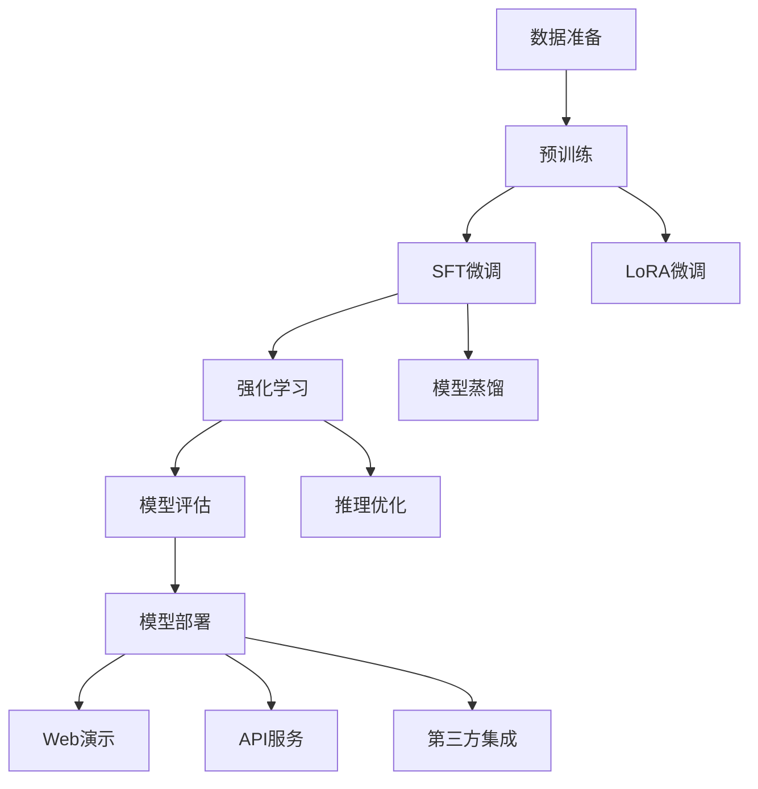

# MiniMind 训练流程指南

## 训练流程总览

MiniMind提供完整的端到端训练流程，从数据准备到模型部署的每个步骤都有详细指导。

### 训练流程图



## 第一阶段：环境准备

### 1.1 硬件要求

#### 最低配置
- **GPU**：NVIDIA GPU，显存≥8GB
- **内存**：≥16GB RAM
- **存储**：≥50GB可用空间

#### 推荐配置
- **GPU**：RTX 3090/4090，显存≥24GB
- **内存**：≥32GB RAM
- **存储**：≥100GB SSD

### 1.2 软件环境

#### 安装依赖
```bash
# 克隆项目
git clone https://github.com/jingyaogong/minimind.git
cd minimind

# 安装依赖
pip install -r requirements.txt -i https://mirrors.aliyun.com/pypi/simple/

# 验证安装
python -c "import torch; print(f'CUDA可用: {torch.cuda.is_available()}')"
```

#### 环境检查脚本
```python
# check_environment.py
import torch
import sys

def check_environment():
    print("=== 环境检查 ===")
    
    # Python版本
    print(f"Python版本: {sys.version}")
    
    # PyTorch版本
    print(f"PyTorch版本: {torch.__version__}")
    
    # CUDA支持
    print(f"CUDA可用: {torch.cuda.is_available()}")
    if torch.cuda.is_available():
        print(f"CUDA版本: {torch.version.cuda}")
        print(f"GPU数量: {torch.cuda.device_count()}")
        for i in range(torch.cuda.device_count()):
            print(f"GPU {i}: {torch.cuda.get_device_name(i)}")
    
    # 内存信息
    if torch.cuda.is_available():
        print(f"GPU内存: {torch.cuda.get_device_properties(0).total_memory / 1024**3:.1f}GB")

if __name__ == "__main__":
    check_environment()
```

## 第二阶段：数据准备

### 2.1 数据集下载

#### 官方数据集
```bash
# 创建数据集目录
mkdir -p dataset

# 下载预训练数据
wget https://www.modelscope.cn/api/v1/datasets/gongjy/minimind_dataset/repo?Revision=master&FilePath=pretrain_hq.jsonl -O dataset/pretrain_hq.jsonl

# 下载SFT数据
wget https://www.modelscope.cn/api/v1/datasets/gongjy/minimind_dataset/repo?Revision=master&FilePath=sft_mini_512.jsonl -O dataset/sft_mini_512.jsonl

# 下载DPO数据
wget https://www.modelscope.cn/api/v1/datasets/gongjy/minimind_dataset/repo?Revision=master&FilePath=dpo.jsonl -O dataset/dpo.jsonl
```

#### 自定义数据格式

**预训练数据格式**
```json
{"text": "完整的中文文本内容，可以是文章、新闻、百科等"}
```

**SFT数据格式**
```json
{
    "conversations": [
        {"role": "user", "content": "你好"},
        {"role": "assistant", "content": "你好！我是MiniMind助手。"},
        {"role": "user", "content": "介绍一下你自己"},
        {"role": "assistant", "content": "我是MiniMind，一个轻量级语言模型..."}
    ]
}
```

**DPO数据格式**
```json
{
    "chosen": [
        {"role": "user", "content": "问题"},
        {"role": "assistant", "content": "优质回答"}
    ],
    "rejected": [
        {"role": "user", "content": "问题"},
        {"role": "assistant", "content": "劣质回答"}
    ]
}
```

### 2.2 数据预处理

#### 数据清洗脚本
```python
# data_preprocess.py
import json
import re
from datasets import load_dataset

def clean_text(text):
    """文本清洗函数"""
    # 移除HTML标签
    text = re.sub(r'<[^>]+>', '', text)
    # 移除多余空白
    text = re.sub(r'\s+', ' ', text).strip()
    # 移除特殊字符
    text = re.sub(r'[^\u4e00-\u9fa5\w\s，。！？：；（）【】《》]', '', text)
    return text

def process_pretrain_data(input_file, output_file, max_length=512):
    """预处理预训练数据"""
    dataset = load_dataset('json', data_files=input_file, split='train')
    
    processed_data = []
    for item in dataset:
        text = clean_text(item['text'])
        if len(text) >= 10 and len(text) <= max_length:
            processed_data.append({'text': text})
    
    # 保存处理后的数据
    with open(output_file, 'w', encoding='utf-8') as f:
        for item in processed_data:
            f.write(json.dumps(item, ensure_ascii=False) + '\n')
    
    print(f"处理完成，原始数据: {len(dataset)}，处理后: {len(processed_data)}")
```

## 第三阶段：模型训练

### 3.1 预训练（Pretrain）

#### 训练命令
```bash
# 单卡训练
python trainer/train_pretrain.py \
    --data_path dataset/pretrain_hq.jsonl \
    --epochs 1 \
    --batch_size 32 \
    --learning_rate 5e-4 \
    --max_seq_len 340 \
    --save_weight pretrain \
    --use_wandb

# 多卡训练（DDP）
torchrun --nproc_per_node 4 trainer/train_pretrain.py \
    --data_path dataset/pretrain_hq.jsonl \
    --epochs 1 \
    --batch_size 8 \
    --learning_rate 5e-4 \
    --max_seq_len 340 \
    --save_weight pretrain
```

#### 关键参数说明
- **epochs**：训练轮数，通常1-3轮
- **batch_size**：批次大小，根据显存调整
- **learning_rate**：学习率，5e-4为推荐值
- **max_seq_len**：序列长度，中文约1.5字符/token
- **use_wandb**：启用训练可视化

### 3.2 监督微调（SFT）

#### 训练命令
```bash
# 全参数微调
python trainer/train_full_sft.py \
    --data_path dataset/sft_mini_512.jsonl \
    --epochs 10 \
    --batch_size 16 \
    --learning_rate 1e-4 \
    --max_seq_len 340 \
    --from_weight pretrain \
    --save_weight full_sft

# LoRA微调
python trainer/train_lora.py \
    --data_path dataset/sft_mini_512.jsonl \
    --epochs 10 \
    --batch_size 16 \
    --learning_rate 1e-3 \
    --max_seq_len 340 \
    --from_weight pretrain \
    --save_weight lora_sft
```

#### SFT训练策略
- **学习率**：比预训练小一个数量级
- **训练轮数**：通常10-20轮
- **数据质量**：对话数据质量比数量更重要
- **评估频率**：每轮训练后进行人工评估

### 3.3 强化学习（RLHF/RLAIF）

#### DPO训练
```bash
python trainer/train_dpo.py \
    --data_path dataset/dpo.jsonl \
    --epochs 3 \
    --batch_size 8 \
    --learning_rate 5e-6 \
    --max_seq_len 512 \
    --from_weight full_sft \
    --save_weight dpo
```

#### PPO训练
```bash
python trainer/train_ppo.py \
    --data_path dataset/rlaif-mini.jsonl \
    --epochs 1 \
    --batch_size 2 \
    --learning_rate 8e-8 \
    --critic_learning_rate 8e-8 \
    --max_seq_len 66 \
    --max_gen_len 1536 \
    --from_weight full_sft \
    --save_weight ppo
```

#### 强化学习要点
- **数据质量**：偏好数据质量至关重要
- **训练稳定**：需要仔细调参防止训练崩溃
- **奖励模型**：PPO需要额外的奖励模型
- **监控指标**：密切关注KL散度和奖励变化

## 第四阶段：模型评估

### 4.1 自动评估

#### 评估脚本
```bash
# 基础评估
python eval_llm.py \
    --weight full_sft \
    --test_data dataset/sft_mini_512.jsonl \
    --max_new_tokens 512 \
    --temperature 0.7

# 批量评估
python eval_llm.py \
    --weight full_sft \
    --eval_mode batch \
    --eval_file eval_questions.jsonl \
    --output_file eval_results.json
```

#### 评估指标
- **困惑度（PPL）**：语言建模质量
- **BLEU分数**：生成质量评估
- **人工评估**：主观质量评分
- **响应长度**：生成文本长度分布

### 4.2 人工评估

#### 评估标准
```python
# 人工评估标准
def human_evaluation_criteria():
    criteria = {
        "fluency": "语言流畅度（1-5分）",
        "coherence": "逻辑连贯性（1-5分）",
        "relevance": "回答相关性（1-5分）",
        "helpfulness": "有用性（1-5分）",
        "safety": "安全性（1-5分）"
    }
    return criteria
```

#### 评估界面
```python
# eval_interface.py
import streamlit as st

def create_evaluation_interface():
    st.title("模型人工评估")
    
    # 问题列表
    questions = load_eval_questions()
    
    for i, question in enumerate(questions):
        st.subheader(f"问题 {i+1}: {question}")
        
        # 模型回答
        responses = get_model_responses(question)
        
        for j, (model_name, response) in enumerate(responses.items()):
            st.write(f"**{model_name}**: {response}")
            
            # 评分界面
            cols = st.columns(5)
            for k, criterion in enumerate(["流畅度", "连贯性", "相关性", "有用性", "安全性"]):
                with cols[k]:
                    st.selectbox(f"{criterion}", [1, 2, 3, 4, 5], key=f"q{i}_m{j}_c{k}")
```

## 第五阶段：模型部署

### 5.1 本地部署

#### API服务
```bash
# 启动OpenAI API兼容服务
python scripts/serve_openai_api.py \
    --model_path ./out/full_sft_512.pth \
    --host 0.0.0.0 \
    --port 8000 \
    --api_key your_secret_key
```

#### Web演示
```bash
# 启动Web界面
streamlit run scripts/web_demo.py \
    --server.port 8501 \
    --server.address 0.0.0.0
```

### 5.2 生产部署

#### Docker部署
```dockerfile
# Dockerfile
FROM pytorch/pytorch:2.0.1-cuda11.7-cudnn8-runtime

WORKDIR /app
COPY . .
RUN pip install -r requirements.txt

EXPOSE 8000
CMD ["python", "scripts/serve_openai_api.py"]
```

#### Kubernetes部署
```yaml
# deployment.yaml
apiVersion: apps/v1
kind: Deployment
metadata:
  name: minimind-api
spec:
  replicas: 2
  selector:
    matchLabels:
      app: minimind
  template:
    metadata:
      labels:
        app: minimind
    spec:
      containers:
      - name: minimind
        image: minimind:latest
        ports:
        - containerPort: 8000
        resources:
          limits:
            nvidia.com/gpu: 1
```

## 第六阶段：监控与优化

### 6.1 训练监控

#### 可视化监控
```python
# 设置WandB监控
import wandb

wandb.init(project="minimind-training")

# 记录关键指标
wandb.log({
    "loss": current_loss,
    "learning_rate": current_lr,
    "perplexity": current_ppl,
    "gradient_norm": grad_norm
})
```

#### 训练检查点
```bash
# 自动保存检查点
python trainer/train_pretrain.py --from_resume 1

# 手动保存
import torch
torch.save({
    'model_state_dict': model.state_dict(),
    'optimizer_state_dict': optimizer.state_dict(),
    'epoch': epoch,
    'loss': loss
}, 'checkpoint.pth')
```

### 6.2 性能优化

#### 推理优化
```python
# 启用KV缓存
model.generate(
    input_ids=input_ids,
    max_new_tokens=100,
    use_cache=True,
    past_key_values=past_key_values
)

# 启用Flash Attention
model.config.use_flash_attention = True
```

#### 内存优化
```python
# 梯度检查点
model.gradient_checkpointing_enable()

# 混合精度训练
scaler = torch.cuda.amp.GradScaler()
with torch.cuda.amp.autocast():
    loss = model(input_ids, labels=labels).loss
scaler.scale(loss).backward()
scaler.step(optimizer)
scaler.update()
```

## 常见问题与解决方案

### 7.1 训练问题

#### 内存不足
```bash
# 解决方案：减小batch_size或序列长度
python trainer/train_pretrain.py --batch_size 8 --max_seq_len 256

# 启用梯度累积
python trainer/train_pretrain.py --batch_size 8 --accumulation_steps 4
```

#### 训练不稳定
```bash
# 解决方案：调整学习率
python trainer/train_pretrain.py --learning_rate 1e-4

# 启用梯度裁剪
python trainer/train_pretrain.py --grad_clip 1.0
```

### 7.2 部署问题

#### API服务无法启动
```bash
# 检查端口占用
netstat -tulpn | grep 8000

# 检查模型路径
ls -la ./out/full_sft_512.pth

# 检查依赖
pip list | grep torch
```

#### 推理速度慢
```python
# 启用编译优化
model = torch.compile(model)

# 启用量化
model = model.half()  # FP16
model = model.bfloat16()  # BF16
```

## 总结

MiniMind训练流程提供了从零开始到生产部署的完整指导：

1. **环境准备**：硬件、软件、依赖检查
2. **数据准备**：下载、清洗、格式化数据
3. **模型训练**：预训练、SFT、强化学习
4. **模型评估**：自动评估和人工评估
5. **模型部署**：本地部署和生产部署
6. **监控优化**：训练监控和性能优化

每个阶段都有详细的配置和调优建议，确保用户能够顺利完成整个训练流程。