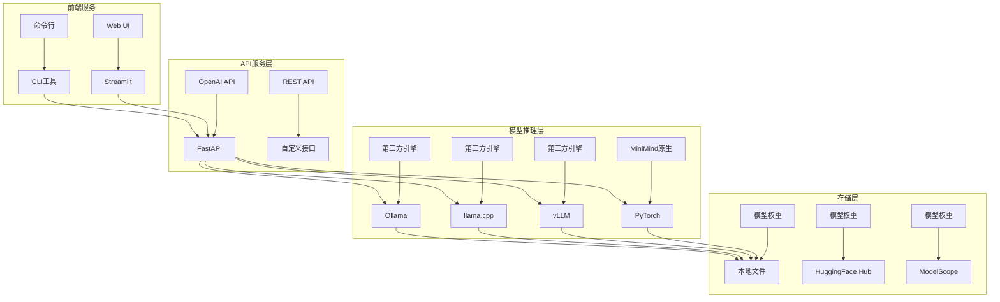

# MiniMind 部署与集成指南

## 部署架构概览

MiniMind提供多种部署方式，支持从本地开发到生产环境的全流程部署。

### 部署架构图



## 模型服务化部署

### 1. OpenAI API兼容服务

#### 服务启动脚本
```bash
# 启动OpenAI API服务
python scripts/serve_openai_api.py \
    --model_path ./MiniMind2 \
    --host 0.0.0.0 \
    --port 8000 \
    --api_key your_api_key
```

#### API接口规范
```python
# 聊天接口
POST /v1/chat/completions
{
    "model": "minimind",
    "messages": [
        {"role": "user", "content": "你好"}
    ],
    "max_tokens": 1024,
    "temperature": 0.7
}

# 响应格式
{
    "id": "chatcmpl-123",
    "object": "chat.completion",
    "created": 1677652288,
    "model": "minimind",
    "choices": [{
        "index": 0,
        "message": {
            "role": "assistant", 
            "content": "你好！我是MiniMind。"
        },
        "finish_reason": "stop"
    }]
}
```

### 2. Web演示界面

#### Streamlit Web应用
```python
# web_demo.py 核心代码
import streamlit as st
from model.model_minimind import MiniMindForCausalLM

def main():
    st.title("MiniMind 聊天演示")
    
    # 模型加载
    if 'model' not in st.session_state:
        with st.spinner('加载模型中...'):
            model, tokenizer = load_model(args.model_path)
            st.session_state.model = model
            st.session_state.tokenizer = tokenizer
    
    # 聊天界面
    if 'messages' not in st.session_state:
        st.session_state.messages = []
    
    for message in st.session_state.messages:
        with st.chat_message(message["role"]):
            st.markdown(message["content"])
    
    if prompt := st.chat_input("请输入您的问题"):
        st.session_state.messages.append({"role": "user", "content": prompt})
        with st.chat_message("user"):
            st.markdown(prompt)
        
        with st.chat_message("assistant"):
            with st.spinner('思考中...'):
                response = generate_response(prompt, st.session_state.model, st.session_state.tokenizer)
                st.markdown(response)
        st.session_state.messages.append({"role": "assistant", "content": response})
```

#### 启动命令
```bash
# 启动Web演示
streamlit run scripts/web_demo.py \
    --server.port 8501 \
    --server.address 0.0.0.0
```

## 第三方推理引擎集成

### 1. vLLM集成

#### 模型转换
```python
# convert_model.py - vLLM格式转换
from vllm import LLM, SamplingParams

def convert_to_vllm_format(model_path, output_path):
    """将MiniMind模型转换为vLLM兼容格式"""
    model = MiniMindForCausalLM.from_pretrained(model_path)
    
    # 保存为vLLM格式
    model.save_pretrained(output_path, safe_serialization=True)
    
    # 创建配置文件
    config = {
        "model_type": "minimind",
        "architectures": ["MiniMindForCausalLM"],
        "vocab_size": 6400,
        "hidden_size": 512,
        "num_hidden_layers": 8,
        "num_attention_heads": 8,
        "max_position_embeddings": 32768
    }
    
    with open(f"{output_path}/config.json", 'w') as f:
        json.dump(config, f, indent=2)
```

#### vLLM服务启动
```bash
# 使用vLLM部署
vllm serve ./MiniMind2/ \
    --served-model-name "minimind" \
    --host 0.0.0.0 \
    --port 8000 \
    --max-model-len 4096 \
    --gpu-memory-utilization 0.9
```

### 2. llama.cpp集成

#### GGUF格式转换
```python
def convert_to_gguf(model_path, output_path):
    """转换为GGUF格式供llama.cpp使用"""
    import gguf
    
    # 加载模型
    model = MiniMindForCausalLM.from_pretrained(model_path)
    
    # 创建GGUF写入器
    gguf_writer = gguf.GGUFWriter(output_path, "minimind")
    
    # 添加模型参数
    gguf_writer.add_tensor("token_embd.weight", model.model.embed_tokens.weight.numpy())
    gguf_writer.add_tensor("output.weight", model.lm_head.weight.numpy())
    
    # 添加配置
    gguf_writer.add_uint32("vocab_size", model.config.vocab_size)
    gguf_writer.add_uint32("hidden_size", model.config.hidden_size)
    gguf_writer.add_uint32("n_layers", model.config.num_hidden_layers)
    
    gguf_writer.write_header_to_file()
    gguf_writer.write_kv_data_to_file()
    gguf_writer.write_tensors_to_file()
    gguf_writer.close()
```

#### llama.cpp使用
```bash
# 编译llama.cpp
git clone https://github.com/ggerganov/llama.cpp
cd llama.cpp && make

# 运行推理
./main -m minimind.gguf -p "你好，我是" -n 100
```

### 3. Ollama集成

#### Modelfile配置
```dockerfile
# Modelfile.minimind
FROM ./minimind.gguf

TEMPLATE """{{ if .System }}<|im_start|>system
{{ .System }}<|im_end|>
{{ end }}{{ range .Messages }}<|im_start|>{{ .Role }}
{{ .Content }}<|im_end|>
{{ end }}<|im_start|>assistant
"""

PARAMETER temperature 0.7
PARAMETER top_p 0.9
PARAMETER num_predict 1024
```

#### Ollama部署
```bash
# 创建模型
ollama create minimind -f Modelfile.minimind

# 运行模型
ollama run minimind "你好，请介绍一下自己"

# 启动API服务
ollama serve
```

## 训练框架集成

### 1. Transformers集成

#### 模型注册
```python
# 注册MiniMind到Transformers
from transformers import AutoConfig, AutoModel

# 添加配置映射
AutoConfig.register("minimind", MiniMindConfig)
AutoModel.register(MiniMindConfig, MiniMindForCausalLM)

# 使用方式
model = AutoModel.from_pretrained("jingyaogong/MiniMind2")
tokenizer = AutoTokenizer.from_pretrained("jingyaogong/MiniMind2")
```

#### 训练器集成
```python
from transformers import Trainer, TrainingArguments

training_args = TrainingArguments(
    output_dir="./results",
    num_train_epochs=3,
    per_device_train_batch_size=4,
    gradient_accumulation_steps=8,
    learning_rate=5e-4,
    fp16=True,
)

trainer = Trainer(
    model=model,
    args=training_args,
    train_dataset=train_dataset,
    data_collator=data_collator,
)

trainer.train()
```

### 2. TRL集成

#### DPO训练
```python
from trl import DPOTrainer

dpo_trainer = DPOTrainer(
    model=model,
    ref_model=ref_model,
    args=training_args,
    train_dataset=dpo_dataset,
    tokenizer=tokenizer,
)

dpo_trainer.train()
```

#### PPO训练
```python
from trl import PPOTrainer, PPOConfig

ppo_config = PPOConfig(
    batch_size=4,
    learning_rate=1e-5,
)

ppo_trainer = PPOTrainer(
    config=ppo_config,
    model=model,
    ref_model=ref_model,
    tokenizer=tokenizer,
)
```

### 3. PEFT集成

#### LoRA微调
```python
from peft import LoraConfig, get_peft_model

lora_config = LoraConfig(
    r=16,
    lora_alpha=32,
    target_modules=["q_proj", "v_proj"],
    lora_dropout=0.1,
)

model = get_peft_model(model, lora_config)
model.print_trainable_parameters()
```

## 生产环境部署

### 1. Docker容器化

#### Dockerfile
```dockerfile
FROM pytorch/pytorch:2.0.1-cuda11.7-cudnn8-devel

WORKDIR /app

# 安装依赖
COPY requirements.txt .
RUN pip install -r requirements.txt -i https://mirrors.aliyun.com/pypi/simple/

# 复制代码
COPY . .

# 暴露端口
EXPOSE 8000

# 启动命令
CMD ["python", "scripts/serve_openai_api.py", "--host", "0.0.0.0", "--port", "8000"]
```

#### Docker Compose
```yaml
version: '3.8'
services:
  minimind-api:
    build: .
    ports:
      - "8000:8000"
    volumes:
      - ./models:/app/models
    environment:
      - CUDA_VISIBLE_DEVICES=0
    deploy:
      resources:
        reservations:
          devices:
            - driver: nvidia
              count: 1
              capabilities: [gpu]
```

### 2. Kubernetes部署

#### Deployment配置
```yaml
apiVersion: apps/v1
kind: Deployment
metadata:
  name: minimind-deployment
spec:
  replicas: 2
  selector:
    matchLabels:
      app: minimind
  template:
    metadata:
      labels:
        app: minimind
    spec:
      containers:
      - name: minimind
        image: minimind:latest
        ports:
        - containerPort: 8000
        resources:
          limits:
            nvidia.com/gpu: 1
        volumeMounts:
        - name: model-storage
          mountPath: /app/models
      volumes:
      - name: model-storage
        persistentVolumeClaim:
          claimName: model-pvc
---
apiVersion: v1
kind: Service
metadata:
  name: minimind-service
spec:
  selector:
    app: minimind
  ports:
  - port: 80
    targetPort: 8000
  type: LoadBalancer
```

### 3. 监控与日志

#### 健康检查接口
```python
@app.get("/health")
async def health_check():
    return {
        "status": "healthy",
        "timestamp": datetime.now().isoformat(),
        "gpu_usage": get_gpu_usage(),
        "memory_usage": get_memory_usage()
    }
```

#### 性能监控
```python
def setup_monitoring():
    import prometheus_client
    from prometheus_client import Counter, Histogram, Gauge
    
    # 定义指标
    request_counter = Counter('minimind_requests_total', 'Total requests')
    response_time = Histogram('minimind_response_time', 'Response time')
    gpu_usage = Gauge('minimind_gpu_usage', 'GPU usage percentage')
    
    @app.middleware("http")
    async def monitor_requests(request, call_next):
        start_time = time.time()
        response = await call_next(request)
        
        # 记录指标
        request_counter.inc()
        response_time.observe(time.time() - start_time)
        
        return response
```

## 客户端集成示例

### 1. Python客户端

```python
import requests

class MiniMindClient:
    def __init__(self, base_url="http://localhost:8000", api_key=None):
        self.base_url = base_url
        self.headers = {"Authorization": f"Bearer {api_key}"} if api_key else {}
    
    def chat(self, messages, max_tokens=1024, temperature=0.7):
        data = {
            "model": "minimind",
            "messages": messages,
            "max_tokens": max_tokens,
            "temperature": temperature
        }
        
        response = requests.post(
            f"{self.base_url}/v1/chat/completions",
            json=data,
            headers=self.headers
        )
        
        return response.json()

# 使用示例
client = MiniMindClient()
response = client.chat([{"role": "user", "content": "你好"}])
print(response['choices'][0]['message']['content'])
```

### 2. JavaScript客户端

```javascript
class MiniMindClient {
    constructor(baseUrl = 'http://localhost:8000', apiKey = null) {
        this.baseUrl = baseUrl;
        this.headers = apiKey ? { 'Authorization': `Bearer ${apiKey}` } : {};
    }
    
    async chat(messages, maxTokens = 1024, temperature = 0.7) {
        const response = await fetch(`${this.baseUrl}/v1/chat/completions`, {
            method: 'POST',
            headers: {
                'Content-Type': 'application/json',
                ...this.headers
            },
            body: JSON.stringify({
                model: 'minimind',
                messages,
                max_tokens: maxTokens,
                temperature: temperature
            })
        });
        
        return await response.json();
    }
}

// 使用示例
const client = new MiniMindClient();
client.chat([{role: 'user', content: 'Hello'}]).then(console.log);
```

## 总结

MiniMind提供了完整的部署和集成解决方案：

1. **多协议支持**：OpenAI API、REST API、WebSocket
2. **多引擎兼容**：原生PyTorch、vLLM、llama.cpp、Ollama
3. **多框架集成**：Transformers、TRL、PEFT
4. **生产就绪**：Docker、Kubernetes、监控告警
5. **客户端友好**：Python、JavaScript、命令行工具

这种设计使得MiniMind可以轻松集成到各种应用场景中，从个人开发到企业级部署都能提供优秀的体验。