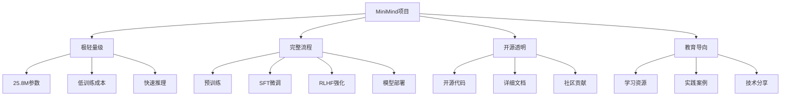
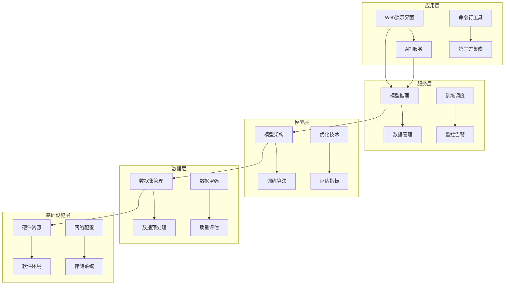
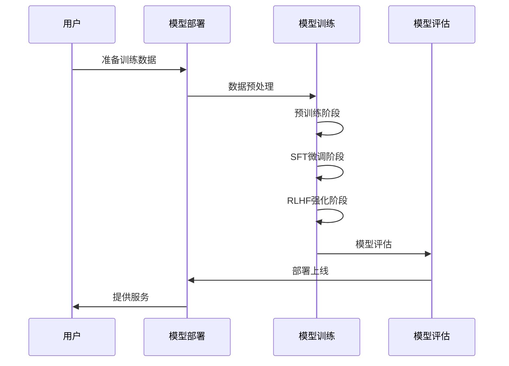
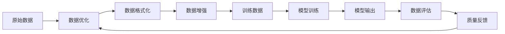
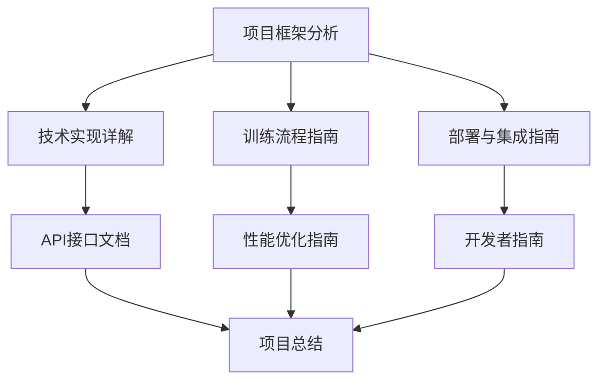

# MiniMind 项目总结

## 项目概述

MiniMind是一个从零开始训练超小语言模型的完整项目，旨在提供轻量级、高效、易用的语言模型训练框架。项目仅需25.8M参数，训练成本极低（约3元2小时），却提供了完整的LLM训练流程。

### 项目核心特点

## 项目架构总览

### 1. 技术架构层次

#### 核心架构图

### 2. 模块功能总结

| 模块类别 | 核心模块 | 主要功能 | 技术特点 |
|---------|---------|---------|---------|
| **模型架构** | model_minimind.py | Transformer架构实现 | 极简化设计、高效注意力 |
| **训练框架** | train_pretrain.py | 预训练流程 | 混合精度、梯度累积 |
| | train_sft.py | SFT微调 | LoRA、全参数微调 |
| | train_dpo.py | DPO训练 | 偏好对齐、强化学习 |
| | train_ppo.py | PPO训练 | 策略优化、价值网络 |
| **数据处理** | lm_dataset.py | 数据集处理 | 动态批处理、数据增强 |
| | sft_dataset.py | SFT数据格式 | 对话数据、指令数据 |
| | rlhf_dataset.py | RLHF数据 | 偏好数据、奖励模型 |
| **部署服务** | serve_openai_api.py | API服务 | OpenAI兼容、高性能 |
| | web_demo.py | Web界面 | Streamlit、交互式 |
| **工具脚本** | convert_model.py | 模型转换 | 格式转换、量化 |
| | eval_llm.py | 模型评估 | 自动评估、人工评估 |

## 技术特色与创新

### 1. 技术创新点

#### 极简化模型设计
- **参数量**：仅25.8M参数，远小于主流大模型
- **架构优化**：精简的Transformer Decoder-Only架构
- **效率优化**：RoPE位置编码、SwiGLU激活函数
- **内存优化**：RMSNorm、高效的注意力机制

#### 完整训练流程
- **端到端训练**：从预训练到部署的完整流程
- **多阶段训练**：预训练→SFT→RLHF的渐进式训练
- **算法丰富**：支持LoRA、DPO、PPO等多种训练算法
- **优化技术**：混合精度、梯度累积、分布式训练

#### 部署友好性
- **多协议支持**：OpenAI API兼容、REST API
- **多引擎兼容**：原生PyTorch、vLLM、llama.cpp、Ollama
- **生产就绪**：Docker容器化、Kubernetes部署
- **监控完善**：健康检查、性能监控、日志记录

### 2. 教育价值

#### 学习资源丰富
- **代码透明**：所有代码开源，便于学习理解
- **文档详细**：完整的开发文档和教程
- **示例丰富**：多种训练和部署示例
- **社区活跃**：活跃的开发者社区和讨论

#### 实践导向
- **低门槛**：极低的硬件要求和训练成本
- **可复现**：完整的训练流程和配置
- **可扩展**：模块化设计便于功能扩展
- **可定制**：支持自定义模型和训练策略

## 业务流程分析

### 1. 核心业务流程

#### 模型训练流程

#### 数据流转流程

### 2. 关键业务指标

#### 性能指标
- **训练速度**：单卡训练时间、多卡加速比
- **推理速度**：响应时间、吞吐量
- **内存使用**：显存占用、内存优化率
- **模型质量**：困惑度、BLEU分数、人工评估

#### 成本指标
- **硬件成本**：GPU使用成本、存储成本
- **训练成本**：电费、云服务费用
- **部署成本**：服务器成本、维护成本

## 技术栈总结

### 1. 核心技术栈

| 技术领域 | 技术选型 | 版本要求 | 主要用途 |
|---------|---------|---------|---------|
| **深度学习框架** | PyTorch | 2.0.0+ | 模型训练和推理 |
| **模型架构** | Transformer | 自定义实现 | 核心模型架构 |
| **训练优化** | TRL, PEFT | 最新版本 | 强化学习、参数高效微调 |
| **数据处理** | Datasets | 2.0.0+ | 数据集管理和处理 |
| **Web框架** | FastAPI, Streamlit | 最新版本 | API服务和Web界面 |
| **部署工具** | Docker, Kubernetes | 最新版本 | 容器化和集群部署 |
| **监控工具** | Prometheus, Grafana | 最新版本 | 性能监控和可视化 |

### 2. 第三方集成

#### 推理引擎集成
- **vLLM**：高性能推理引擎
- **llama.cpp**：CPU优化推理
- **Ollama**：本地模型管理
- **Transformers**：HuggingFace生态集成

#### 云服务集成
- **AWS SageMaker**：云端训练
- **Google Colab**：在线实验
- **HuggingFace Hub**：模型分享
- **ModelScope**：国内模型平台

## 项目文档体系

### 1. 已创建的文档

#### 核心文档
1. **项目框架分析.md** - 项目概述、架构设计、技术栈
2. **技术实现详解.md** - 模型架构、训练算法、优化技术
3. **训练流程指南.md** - 从数据准备到模型部署的完整流程
4. **部署与集成指南.md** - 模型服务化、API接口、第三方集成
5. **API接口文档.md** - API设计规范、接口说明、客户端SDK
6. **开发者指南.md** - 开发环境、代码规范、贡献指南
7. **性能优化指南.md** - 训练优化、推理优化、硬件优化
8. **项目总结.md** - 项目总结、技术特色、未来规划

#### 文档结构关系

### 2. 文档使用指南

#### 新手入门路径
1. **项目框架分析** → 了解项目整体架构
2. **训练流程指南** → 学习完整训练流程
3. **技术实现详解** → 深入技术细节

#### 开发者路径
1. **开发者指南** → 搭建开发环境
2. **API接口文档** → 理解接口规范
3. **性能优化指南** → 学习优化技术

#### 部署运维路径
1. **部署与集成指南** → 学习部署方法
2. **API接口文档** → 掌握API使用
3. **性能优化指南** → 优化生产环境

## 项目价值与影响

### 1. 技术价值

#### 技术创新
- **模型轻量化**：证明了小参数模型的有效性
- **训练效率**：展示了低成本训练的可能性
- **部署友好**：提供了多种部署方案
- **生态集成**：与主流工具链的良好集成

#### 教育价值
- **学习资源**：为AI学习者提供了完整案例
- **实践平台**：降低了LLM训练的门槛
- **社区贡献**：促进了开源AI社区的发展

### 2. 应用前景

#### 应用场景
- **教育领域**：AI教学和实验平台
- **研究领域**：算法验证和原型开发
- **工业领域**：轻量级AI应用部署
- **个人项目**：个人AI助手和工具开发

#### 扩展方向
- **多模态扩展**：支持图像、音频等多模态数据
- **领域适配**：针对特定领域进行优化
- **硬件优化**：针对边缘设备的优化
- **生态建设**：构建完整的应用生态

## 未来发展规划

### 1. 技术路线图

#### 短期目标（3-6个月）
- **模型优化**：进一步提升模型性能
- **训练效率**：优化训练速度和资源使用
- **部署体验**：简化部署流程和配置
- **文档完善**：增加更多示例和教程

#### 中期目标（6-12个月）
- **功能扩展**：支持更多训练算法和模型架构
- **生态建设**：构建更完整的工具链和生态
- **社区发展**：扩大社区影响力和贡献者
- **应用案例**：开发更多实际应用案例

#### 长期目标（1年以上）
- **技术创新**：探索新的模型架构和训练方法
- **产业应用**：推动在产业界的实际应用
- **标准制定**：参与相关技术标准的制定
- **教育推广**：成为AI教育的重要平台

### 2. 社区建设

#### 社区发展策略
- **开源协作**：鼓励社区贡献和协作开发
- **技术分享**：定期组织技术分享和讨论
- **文档翻译**：支持多语言文档建设
- **应用案例**：收集和分享用户应用案例

#### 贡献者激励
- **代码贡献**：建立贡献者认可机制
- **文档贡献**：鼓励文档改进和翻译
- **问题反馈**：建立有效的问题反馈机制
- **社区活动**：组织线上线下的社区活动

## 总结

MiniMind项目作为一个轻量级语言模型训练框架，具有以下核心价值：

1. **技术先进性**：采用最新的模型架构和训练技术
2. **实用性**：提供完整的训练和部署解决方案
3. **教育性**：为AI学习者提供了优秀的学习平台
4. **开放性**：完全开源，促进技术共享和创新
5. **可扩展性**：模块化设计便于功能扩展和定制

通过本项目的分析和文档建设，我们为开发者、研究者和学习者提供了全面的技术参考和实践指南。MiniMind不仅是一个技术项目，更是一个促进AI技术发展和普及的重要平台。

随着AI技术的不断发展，MiniMind将继续演进，为更广泛的用户群体提供价值，推动人工智能技术的民主化和普及化。