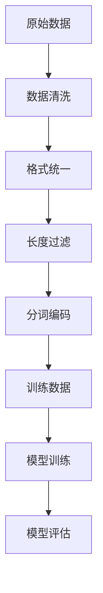
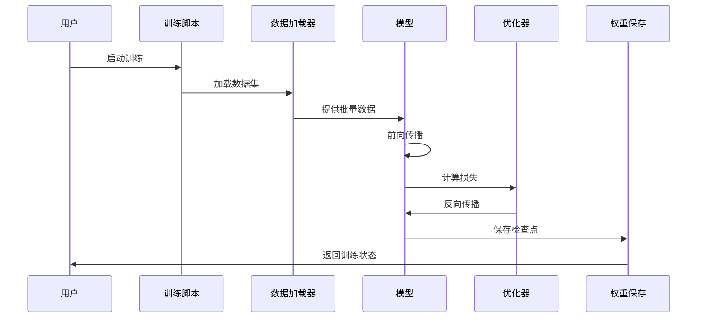
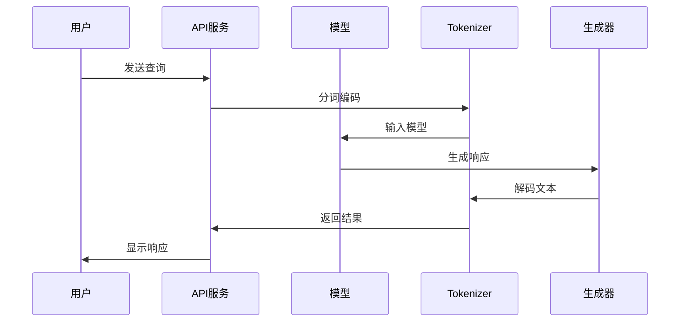

# MiniMind 项目框架分析文档

## 项目概述

MiniMind 是一个从零开始训练超小语言模型的开源项目，旨在通过极低的成本（3元+2小时）训练出仅25.8M参数的轻量级语言模型。项目提供了完整的训练流程，包括预训练、监督微调、强化学习等，所有核心算法均使用PyTorch原生实现。

### 核心特点
- **极低成本**：最低仅需3元服务器成本，2小时训练时间
- **完整流程**：覆盖从预训练到强化学习的全流程
- **原生实现**：不依赖第三方抽象接口，从零实现核心算法
- **轻量设计**：最小版本体积仅为GPT-3的1/7000
- **多模态支持**：支持视觉多模态VLM拓展

## 项目架构

### 目录结构
```
minimind/
├── model/                 # 模型定义
│   ├── model_minimind.py  # 核心模型架构
│   ├── model_lora.py      # LoRA微调实现
│   └── tokenizer.json     # 分词器配置
├── trainer/               # 训练器
│   ├── train_pretrain.py  # 预训练
│   ├── train_full_sft.py  # 全参数微调
│   ├── train_lora.py      # LoRA微调
│   ├── train_dpo.py       # DPO训练
│   ├── train_ppo.py       # PPO强化学习
│   ├── train_grpo.py      # GRPO训练
│   ├── train_spo.py       # SPO训练
│   └── trainer_utils.py   # 训练工具函数
├── dataset/               # 数据集处理
│   ├── lm_dataset.py     # 数据集加载器
│   └── dataset.md        # 数据集说明
├── scripts/              # 脚本工具
│   ├── web_demo.py       # Web演示界面
│   ├── serve_openai_api.py # OpenAI API服务
│   └── convert_model.py  # 模型转换
└── eval_llm.py          # 模型评估
```

## 核心设计理念

### 1. 极简主义设计
- **参数精简**：通过自定义分词器（仅6400词表）大幅减少模型体积
- **架构优化**：采用Transformer Decoder-Only结构，使用RMSNorm、SwiGLU等现代优化
- **计算效率**：支持Flash Attention、混合精度训练等加速技术

### 2. 教育导向
- **透明实现**：所有算法从零实现，便于学习理解
- **模块化设计**：每个训练阶段独立实现，可单独使用
- **详细注释**：代码包含丰富注释和原理说明

### 3. 生产就绪
- **多框架兼容**：支持transformers、trl、peft等主流框架
- **部署友好**：提供OpenAI API接口和Web演示
- **多卡支持**：支持DDP、DeepSpeed分布式训练

## 技术架构详解

### 模型架构 (model_minimind.py)

#### 核心组件
```python
class MiniMindConfig:
    # 模型配置参数
    hidden_size: int = 512          # 隐藏层维度
    num_hidden_layers: int = 8      # Transformer层数
    num_attention_heads: int = 8    # 注意力头数
    vocab_size: int = 6400          # 词表大小
    use_moe: bool = False          # 是否使用MoE架构
```

#### 关键技术特性
1. **位置编码**：使用RoPE（旋转位置编码），支持YaRN长文本外推
2. **归一化**：RMSNorm替代LayerNorm，计算更高效
3. **激活函数**：SwiGLU替代ReLU，提升模型表达能力
4. **MoE支持**：可选混合专家架构，提升模型容量

### 训练流程架构

#### 1. 预训练阶段
- **目标**：学习语言基础知识
- **数据**：高质量中文语料（pretrain_hq.jsonl）
- **技术**：自回归语言建模，梯度累积，学习率调度

#### 2. 监督微调（SFT）
- **目标**：学习对话能力
- **数据**：多源对话数据（sft_*.jsonl）
- **技术**：指令微调，序列到序列学习

#### 3. 强化学习（RLHF/RLAIF）
- **DPO**：直接偏好优化，无需奖励模型
- **PPO**：近端策略优化，支持Actor-Critic架构
- **GRPO/SPO**：Group/Sequence偏好优化变体

## 数据流转分析

### 数据处理流程



### 数据集类型

1. **预训练数据**（pretrain_hq.jsonl）
   - 格式：`{"text": "完整文本内容"}`
   - 特点：高质量中文语料，长度<512字符

2. **SFT数据**（sft_*.jsonl）
   - 格式：多轮对话格式
   - 特点：包含用户-助手对话轮次

3. **DPO数据**（dpo.jsonl）
   - 格式：偏好对（chosen/rejected）
   - 特点：包含人类偏好标注

### 数据预处理
- **分词**：使用自定义MiniMind分词器
- **填充**：动态padding，优化内存使用
- **截断**：智能截断策略，保留语义完整性

## 业务流程

### 训练业务流程



### 推理业务流程



## 关键技术实现

### 1. 注意力机制优化
```python
class Attention(nn.Module):
    def __init__(self, config):
        # 支持Flash Attention加速
        self.flash = hasattr(F, 'scaled_dot_product_attention')
    
    def forward(self, x, position_embeddings):
        if self.flash:
            # 使用Flash Attention
            output = F.scaled_dot_product_attention(xq, xk, xv)
        else:
            # 传统注意力实现
            scores = (xq @ xk.transpose(-2, -1)) / math.sqrt(dim)
```

### 2. MoE架构实现
```python
class MOEFeedForward(nn.Module):
    def __init__(self, config):
        self.experts = nn.ModuleList([FeedForward(config) for _ in range(config.n_routed_experts)])
        self.gate = MoEGate(config)  # 专家选择门控
```

### 3. 强化学习算法
```python
def ppo_train_epoch(epoch, loader, model, reward_model):
    # PPO核心算法
    ratio = torch.exp(new_logp - old_logp)
    surr1 = ratio * advantages
    surr2 = torch.clamp(ratio, 1-ε, 1+ε) * advantages
    policy_loss = -torch.min(surr1, surr2).mean()
```

## 部署与集成

### 1. 模型服务化
- **OpenAI API兼容**：提供标准API接口
- **Web演示**：基于Streamlit的交互界面
- **多框架支持**：兼容llama.cpp、vllm、ollama等

### 2. 训练监控
- **可视化**：支持WandB/SwanLab训练监控
- **检查点**：自动保存和恢复训练状态
- **分布式**：支持多机多卡训练

## 性能优化策略

### 计算优化
1. **混合精度训练**：FP16/BF16支持
2. **梯度累积**：模拟大batch size训练
3. **激活检查点**：内存优化技术

### 内存优化
1. **梯度裁剪**：防止梯度爆炸
2. **动态序列长度**：根据数据特点优化
3. **KV缓存**：推理时优化内存使用

## 扩展性与可维护性

### 模块化设计
- 每个训练阶段独立实现
- 配置驱动，参数可灵活调整
- 支持插件式扩展

### 代码质量
- 类型注解完善
- 错误处理机制健全
- 文档和示例丰富

## 总结

MiniMind项目通过极简的设计理念和完整的技术实现，为LLM学习和研究提供了优秀的实践平台。其核心价值在于：

1. **教育价值**：透明化的实现便于深度学习
2. **实用性**：生产级别的代码质量和功能
3. **可扩展性**：模块化设计支持灵活扩展
4. **社区友好**：完善的文档和示例

该项目不仅是一个功能完整的语言模型框架，更是学习现代深度学习技术的优秀教材。